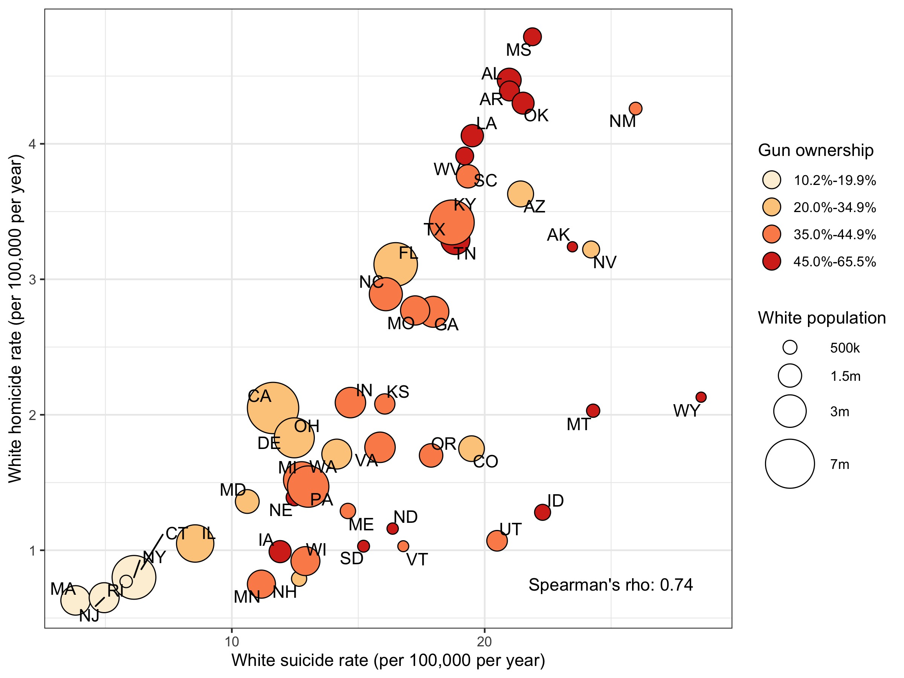

### Exercise

* The purpose of this exercise is to make a publication-ready plot using your
`dplyr` and `ggplot2` skills. 

* Open the journal article "Articles/Riddell_Annals_Hom-Sui-Disparities.pdf"
Read the abstract and have a look at Figure 3.

* The data you need to make this plot is "Data/CDC_Males.csv"

* You'll have 45 minutes to see what you can come up with in groups or individually!

### Figure 3

```{r, out.width="80%", fig.align='center', echo=F}

```
